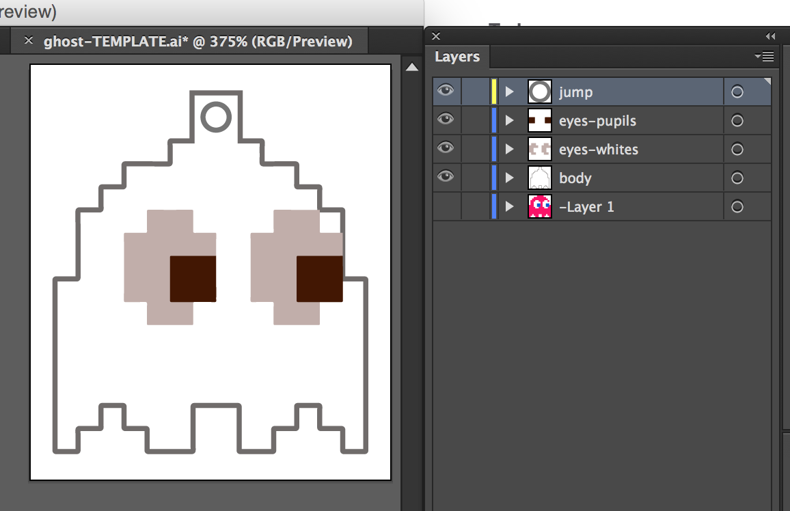
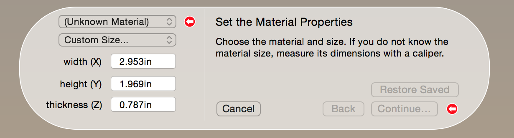
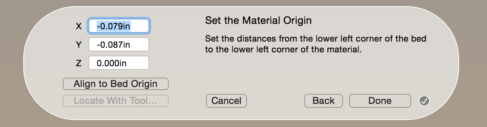
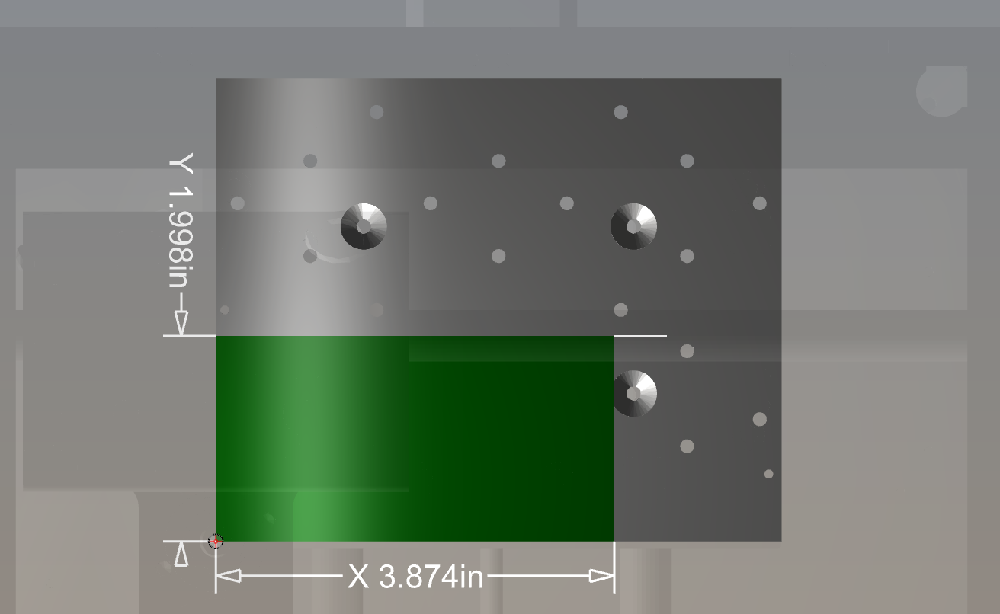
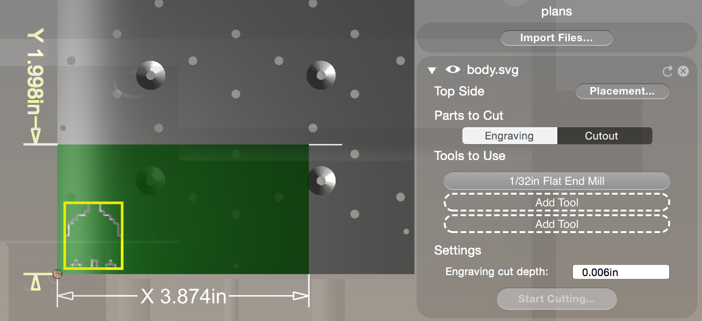
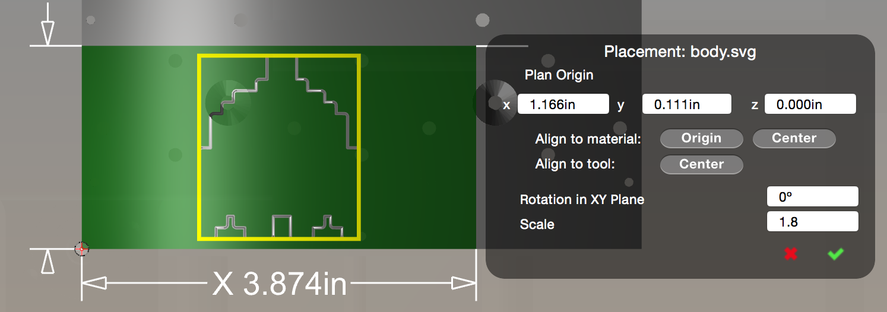
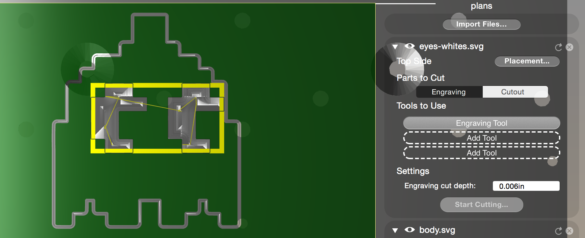
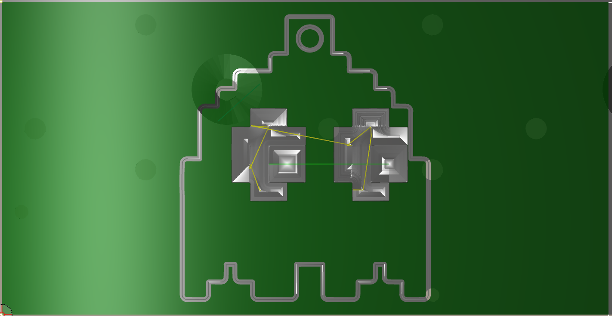

# Othermill

[Othermill](https://othermachine.co/othermill/features/) is a product of Other Machine, Co.

> The Othermill is a portable, precise milling machine that allows you to create 2D and 3D objects out of durable materials, such as wood, metal, and plastic, using digital designs. We believe that everyone should be able to use professional tools, so we’ve designed easy-to-use software and provided the tools and materials you need to get started.

Code for America has an Othermill located in the makerspace room in the basement. You can join the `#makerspace` channel on Slack to talk to someone who has used it before if you'd like to get an in-person intro.

# Terminology

* **SVG**: Scalable Vector Graphic - an image format `.svg`
* **Jump**: The hole in the pendant that hooks into the loop and necklace.
* **Bed**: The plate that your material rests on in the Othermill
* **Plan**: The combination of your layers for engraving/cuting
* **Cutout**: full gauge cut through the material, typically defined by a stroke in your SVG element
* **Engrave**: the engraving portion of your design, that doesn't cut through the entire depth of your material.

# Howto

Below are the steps for making a necklace pendant.

### 0. Preparation & Materials

In order to do the following, you'll need a few things.

1. Makerplan, the free software provided by Other Machine, Co. to connect to an Othermill via USB. It can be [downloaded here](https://othermachine.co/otherplan/download/).
2. Materials: if you are going to be engraving metal you can find some good materials at the nearby bead shop [Beyond Beads](https://www.google.com/maps/place/Beyond+Beads,+1251+Howard+St,+San+Francisco,+CA+94103,+United+States/@37.7754022,-122.4123777,15z/data=!4m2!3m1!1s0x80858082ca3c007d:0x24bac2151b443da0) or a hardware store.
3. Calipers for extremely precise measurement (for material gauge measurement)
4. Waffles*

### 1. Design

What are you going to mill? Start with a drawing or searching images online to get inspired. From here on out, we'll be designing [Ghost](https://en.wikipedia.org/wiki/Ghosts_(Pac-Man)) from Pac-Man.

### 2. Vectorize

Otherplan uses SVG files to plan the cuts. You can use Adobe Illustrator or Inkscape to generate SVG objects of your design. Note: **strokes** will be cuts and **fills** will be engravings. Here is the `Ghost.ai` file with different layers for each piece of the Ghost:

**Export the layers** as their own separate SVG file. *Note: hiding the layers doesn't mean they won't export as `.svg` files.* If you have a lot of layers, using the [MultiExport script](http://www.ericson.net/content/2011/10/illustrator-multiexporter-jpg-and-eps/) to export layers as their own unique files will be extremely helpful.

### 3. Measure & add material layer to Otherplan

Otherplan works with "layers" and engraves/cuts them each individually with whichever tool is necessary.

The first part of the plan to set up is your material layer. Click the "Set up Material" button in the top right *Setup* box.

**Measure your material (X, Y, Z) and enter the information**. You should use a precise caliper to make these measurements, especially for the `Z` axis (depth/gauge of the material). If you type in `mm` in your measurements, it will automatically convert into `in`.

**Set the origin of the material**. It's easiest to go with the origin of the Othermill bed, which is the bottom left.

Once you press "Done" you should see a layer of your material on the bed.

### 4. Add plan layers

Each `.svg` file is a layer within the *Plan*. Beneath "setup" you'll see "plan" and a button that says "Import files". Click this and select the first file you'd like to import. Let's import the outline of the Ghost, `body.svg`. Since this is a *cutout* we will want to make sure we aren't using the engraving tool and use the router size that makese sense. Unselect "engraving" and change the tools to a single *Flat End Mill* size that you want.

Click the "placement" button on the layer. Here you can chance the origin and the scale of the image.

**Next we'll import the `eye-whites.svg` file**, which is engravement instead of cutting. Notice that you should unselect "cutout" and just use "engraving". Select the engraver tool as well by clicking the tool and scrolling to the bottom.

**Add the rest of your layers** and align them accordingly.

### 5. Add materials to the bed

### 6. Start engraving/cutout process

**calibrate tool depth**

**Change tools as needed**

### 7. Watch it do magic

### 8. Profit.

